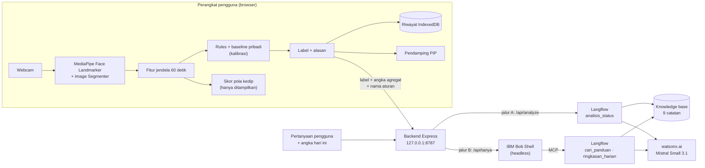

# Equilibre

Equilibre adalah web app pendamping kerja yang membantu pekerja di depan komputer mengenali tanda kelelahan sebelum berubah
menjadi stres dan burnout. MediaPipe berjalan langsung di browser untuk membaca indikator mata dan wajah (kedip, PERCLOS,
menguap, posisi kepala) serta keberadaan tubuh di depan kamera. **Video dan data wajah tidak pernah keluar dari perangkat.**
Yang dikirim ke server hanya label, angka ringkasan, dan nama aturan yang terpenuhi. Flow **IBM Langflow** menyusun rekomendasi
jeda berbasis bukti dalam Bahasa Indonesia, dan **IBM Bob** menjadi agen percakapan "Tanya Equilibre" yang memanggil flow
Langflow lewat MCP.

> Status: prototipe untuk IBM × Hacktiv8 National Hackathon 2026. Berjalan lokal (`localhost`), belum di-deploy.
> Equilibre memberikan **indikator risiko**, bukan diagnosis medis.

## Arsitektur



- **Jalur A (rekomendasi):** tombol "Minta saran sekarang" (halaman Sekarang) atau saran otomatis → backend → flow `analisis_status`
  → rekomendasi jeda + alasan + sumber.
- **Jalur B (percakapan):** halaman "Tanya" → backend menjalankan IBM Bob → Bob memilih salah satu dari dua tool Langflow
  lewat MCP → jawaban + sumber.
- Backend menyimpan API key Langflow dan Bob, sehingga browser tidak pernah memegang kunci apa pun.

### Data yang keluar dari perangkat

| Ke mana | Isi | Penjaga |
|---|---|---|
| `POST /api/analyze` → Langflow | `label`, `skor`, `tanda` (nama aturan), `perclos`, `kedip_per_menit`, `durasi_kedip_ms`, `mata_tertutup_lama`, `menguap`, `pct_kepala_menunduk`, `pct_wajah_hilang`, `menit_sejak_jeda`, `menit_lelah_60` | `server/src/features.ts` menolak field lain dan angka di luar rentang; `tanda` hanya boleh dari daftar tetap |
| `POST /api/tanya` → Bob → Langflow | teks pertanyaan (3–300 karakter), label terakhir, `menit_lelah_60`, dan angka hari ini (menit per label, jumlah jeda, rata-rata KSS) | `server/src/tanya.ts` menolak field lain; halaman Tanya menyebutkan apa yang dikirim di bawah kotak pertanyaan |
| tidak pernah | video, gambar, landmark wajah, EAR per frame, baseline kalibrasi, skor pola kedip, riwayat | diproses dan disimpan hanya di browser |

## Deteksi di browser

**Kalibrasi (sekali, ±5 menit).** Tahap 1: pejamkan mata sampai terdengar bunyi (EAR mata terpejam). Tahap 2: bekerja seperti
biasa selama 5 menit (EAR terbuka, kedip per menit, durasi kedip, sudut kepala, bukaan mulut, luas tubuh, dan statistik
kedipan). Hasilnya jadi **baseline pribadi** di `localStorage`, jadi setiap batas dinilai terhadap orang itu sendiri.

**Fitur tiap jendela 60 detik, dievaluasi tiap 10 detik** (`web/src/features.ts`, `blink.ts`, `yawn.ts`, `body.ts`):

- PERCLOS: porsi frame dengan mata tertutup (EAR di bawah 8% rentang terbuka–terpejam); kedip pendek < 500 ms tidak dihitung.
- Kedip per menit dan durasi kedip rata-rata; mata terpejam ≥ 1 detik dihitung terpisah.
- Menguap: `jawOpen` ≥ 0,5 selama ≥ 1,5 detik.
- Kepala menunduk ≤ −15° dari sudut kalibrasi: mata tidak dinilai (kelopak ikut turun saat melihat HP/dokumen), hanya dicatat.
- Tubuh (MediaPipe Image Segmenter, 2×/detik): mask diringkas jadi luas dan gerak, lalu langsung dibuang.

**Aturan → label** (`web/src/rules.ts`, satu kalimat alasan per aturan, lengkap dengan angka dan batasnya):

| Tanda | Kondisi |
|---|---|
| `mata_sering_tertutup` | PERCLOS ≥ 8% (≥ 15% langsung `lelah`) |
| `kedipan_lambat` | durasi kedip rata-rata ≥ 2× baseline |
| `menguap` | ≥ 1 kali dalam jendela |
| `mata_terpejam_lama` | ≥ 1 kali mata terpejam 1 detik atau lebih |
| `kedipan_sering` | kedip ≥ 2× baseline, **hanya pendukung** (dihitung kalau sudah ada tanda lain) |

| Label | Syarat |
|---|---|
| `normal` | tidak ada tanda |
| `lelah ringan` | 1–2 tanda |
| `lelah` | ≥ 3 tanda, atau PERCLOS ≥ 15% |
| `tertidur` | tubuh tetap di depan kamera dan diam, sementara mata terlihat terpejam selama 5 menit, atau tidak terlihat sama sekali selama 10 menit (misalnya kepala di meja) |
| `tidak di depan layar` | wajah tidak terdeteksi ≥ 50% jendela |

- **Hysteresis:** label baru baru tampil setelah muncul 2 evaluasi berturut-turut.
- **Label ditahan** saat kamera < 3 fps (tab tersembunyi) atau saat mata tidak terlihat tapi tubuh masih ada (melihat HP).
- **Saran istirahat panjang:** ≥ 15 menit `lelah`/`tertidur` dalam 60 menit terakhir → saran berhenti, bila perlu minta izin.
- **Jeda** tercatat saat wajah dan tubuh tidak terlihat ≥ 2 menit, atau lewat tombol "Saya sudah jeda".
- **Mode hemat daya:** deteksi 5 fps (bawaan 10 fps), menyala sendiri saat baterai < 20% dan tidak diisi.
- **Pendamping (Picture-in-Picture):** jendela kecil berisi karakter beruang yang ekspresinya mengikuti label dan menyapa saat
  `lelah`/`tertidur`. Selama jendela ini terbuka, deteksi tetap ±10 fps walau tab Equilibre tersembunyi (terukur 9,9 fps).
- Semua threshold adalah konstanta bernama di modulnya; yang masih nilai awal ditandai ⚠️ di kode.

### Skor pola kedip (UTA-RLDD)

Halaman Teknis menampilkan **skor pola kedip**: peluang bahwa 30 kedipan terakhir mirip pola orang mengantuk.
Fiturnya dari paper UTA-RLDD (durasi, amplitudo, kecepatan membuka mata, frekuensi; dinormalkan terhadap kedipan kalibrasi
orang itu), lalu regresi logistik (`web/src/blinkScore.ts`). Skor ini **hanya informasi**: tidak mengubah label dan tidak
dikirim ke server.

Model dilatih dan diuji pada video UTA-RLDD yang diekstrak dengan pipeline app sendiri (`web/extract.html`,
`web/scripts/rldd-*.ts`). Konfigurasi dikunci sebelum data uji diunduh, lalu diuji **sekali** pada 6 orang yang belum pernah
dilihat:

| Tugas (jendela 60 detik) | Classifier | Tebak kelas mayoritas | Rules Equilibre | Kontrol label acak | Hasil |
|---|---|---|---|---|---|
| segar vs mengantuk (fitur kedipan), 471 jendela | **77,9%**, macro-F1 0,764, 10/12 video | 69,9% (F1 0,411) | 38,0% | 69,9% | lolos |
| 3 kelas (segar / waspada rendah / mengantuk) | 28,2% | 40,6% | 22,1% | 41,7% | gagal, tidak dipakai |

Model yang terpasang dilatih ulang pada 12 orang (leave-one-subject-out 73,5%, 17/24 video).

## Langflow: tiga flow

Ekspor JSON ada di `langflow-flows/` (tanpa API key). Ketiganya memakai pola yang sama: **Chat Input → Prompt Template (+
Knowledge → Parser) → Language Model → Chat Output**. LLM: watsonx.ai `mistralai/mistral-small-3-1-24b-instruct-2503`
(region Dallas, temperature 0,2, maks. 512 token). Embedding knowledge base: watsonx.ai `intfloat/multilingual-e5-large`.

| Flow | Dipanggil oleh | Input | Output |
|---|---|---|---|
| `analisis_status` | backend, jalur A | JSON fitur + keputusan server (status, durasi jeda, saran istirahat panjang) | JSON `{rekomendasi, alasan, sumber}` |
| `cari_panduan` | IBM Bob lewat MCP | pertanyaan pengguna | jawaban dari knowledge base + sumber, atau "Maaf, panduan Equilibre belum membahas hal itu." |
| `ringkasan_harian` | IBM Bob lewat MCP | angka hari ini dari app | ringkasan kondisi kerja hari ini (tanpa knowledge base) |

**Status diputuskan server, bukan LLM** (`server/src/features.ts`), supaya kata-katanya konsisten dan LLM tidak menilai ulang:

| Label | Status | Jeda | Kueri knowledge base |
|---|---|---|---|
| `normal` | baik | – | istirahat mata saat bekerja lama di depan layar |
| `lelah ringan` | perlu jeda singkat | 5 menit | jeda singkat untuk mengurangi lelah |
| `lelah` | perlu jeda | 10 menit | istirahat dan peregangan |
| `tertidur` | perlu jeda aktif | 10 menit | bergerak, cahaya terang, minum air, udara segar |
| ≥ 15 menit lelah dalam 1 jam | perlu istirahat panjang | – | berhenti, istirahat cukup, cuti |

Label `tidak di depan layar` tidak dikirim. Kalau jawaban Mistral gagal atau bukan JSON, flow yang sama dijalankan sekali lagi
dengan model cadangan (Qwen3.8 Flash lewat OpenRouter).

**Aturan utama prompt `analisis_status`** (`langflow-flows/prompt-analisis_status.txt`): status dan durasi jeda tidak boleh
diubah; kegiatan hanya dari KONTEKS knowledge base; alasan hanya dari daftar `tanda` (tidak menilai angka sendiri, kepala
menunduk bukan tanda lelah); tidak mendiagnosis atau menyebut penyakit; `sumber` = nama file catatan yang benar-benar dipakai;
balasan hanya JSON.

**Knowledge base** (`knowledge/`): parafrase 9 sumber (WHO, NIOSH, Permenkes 48/2016, Kemenkes Healing119, PLOS ONE, SLEEP
Advances, American Academy of Ophthalmology, Environmental Health Perspectives, Regulation (EU) 432/2012), masing-masing dengan
sitasi dan lisensi. Klaim yang tidak ada di catatan tidak boleh muncul di rekomendasi; daftarnya di `knowledge/README.md`.

**Saran otomatis** (toggle "Minta saran otomatis" di halaman Privasi & pengaturan, bawaan mati): hanya saat label berubah menjadi `lelah ringan`/`lelah`/`tertidur`
atau saran istirahat panjang muncul, paling sering sekali per 10 menit (`tertidur` dan istirahat panjang boleh menembus sekali,
jadi maksimal 2 panggilan per 10 menit).

## Tanya Equilibre (IBM Bob + Langflow lewat MCP)

Halaman "Tanya" mengirim pertanyaan ke `POST /api/tanya`. Backend menjalankan IBM Bob Shell secara headless
(`bob run --format json`) dari folder kerja terpisah (`../bob-workspace/`, berisi konfigurasi MCP ke Langflow). Bob memilih
satu dari dua tool Langflow: `cari_panduan` (tanya-jawab dari knowledge base) atau `ringkasan_harian` (merangkum angka riwayat
hari ini), lalu jawabannya ditampilkan di app beserta sumbernya. `analisis_status` tidak dibuka untuk Bob, karena statusnya
diputuskan server, bukan LLM.

- **Pengaman:** hanya tool group `mcp` yang aktif (baca/tulis file, terminal, browser dimatikan), pertanyaan dibungkus sebagai
  data di dalam penanda tetap, `--max-turns 4`, `--max-cost 0.05`, batas waktu 90 detik, satu pertanyaan sekaligus.
- **Jawaban hanya dari flow:** backend mengecek Langflow hidup sebelum menjalankan Bob, dan menolak jawaban Bob yang tidak
  memanggil tool sama sekali (`stats.tool_calls` < 1) atau menulis panggilan tool sebagai teks: tanpa Langflow, Bob mengarang
  saran sendiri. Prompt Bob memintanya menyalin keluaran flow apa adanya. Jawaban "belum membahas hal itu" tidak pernah
  membawa sumber, dan kalimat "belum ada riwayat" dibuang kalau app mengirim angka hari ini.
- **Batas topik:** `cari_panduan` hanya menjawab keluhan yang tertulis di catatan knowledge base; keluhan lain (misalnya pusing
  atau mual) dijawab "Maaf, panduan Equilibre belum membahas hal itu." tanpa sumber.
- **Prasyarat:** Bob Shell 2.0.4 terpasang global lewat npm (atau atur `BOB_JS`), `BOB_API_KEY` di `.env`, dan server MCP
  `equilibre-langflow` di `bob-workspace/.bob/mcp.json` dengan `alwaysAllow: ["cari_panduan", "ringkasan_harian"]` dan
  `disabledTools: ["analisis_status"]`.

## Riwayat dan umpan balik

Riwayat disimpan di IndexedDB browser, **hanya di perangkat**, selama 30 hari: label tiap 10 detik beserta angka
ringkasannya, jeda, rekomendasi Langflow dan umpan baliknya ("sudah dilakukan" / "tidak relevan"), koreksi label dari
pengguna ("Label ini tidak sesuai"), dan isian Karolinska Sleepiness Scale (KSS). Halaman "Insight" menampilkan satu hari per
tampilan (lihat "Antarmuka"); riwayat bisa diunduh sebagai JSON atau dihapus seluruhnya dari halaman Privasi & pengaturan.

## Antarmuka

Satu halaman web dengan lima tab (`web/index.html`, navigasi lewat hash URL di `web/src/router.ts`). Kamera tampil sebagai
pratinjau kecil di samping semua tab, karena detektor membaca video itu terus; di layar sempit pratinjau mengambang di pojok
dan tab pindah ke bawah.

| Tab | Isi |
|---|---|
| **Sekarang** | Label saat ini dalam kalimat biasa bersama beruang yang matanya mengikuti label (`statusCopy.ts`, `bear.ts`); "Kenapa Equilibre menilai begini?" berisi kalimat alasan dari aturan dan tombol "Label ini tidak sesuai?"; ringkasan hari ini (menit sejak jeda, waktu dipantau, jumlah jeda, satu batang komposisi label); "Minta saran sekarang" dengan umpan balik; cek kantuk KSS |
| **Insight** | Satu hari: 2–3 kalimat ringkasan dan empat angka (`insight.ts`), waktu per label untuk kelima label, garis tingkat kelelahan (normal 0 … tertidur 3, rata-rata per 1/5/10 menit, putus saat tidak dipantau, jeda diarsir), menit per jam bertumpuk dengan tabelnya, saran hari itu dengan umpan baliknya, dan rincian angka |
| **Tanya** | Percakapan dengan IBM Bob: contoh pertanyaan, gelembung tanya-jawab beserta sumbernya; tiap pertanyaan tetap dijawab sendiri-sendiri |
| **Privasi & pengaturan** | Apa yang keluar dari perangkat, kalibrasi, saran otomatis, hemat daya, pendamping, unduh/hapus riwayat, dan batasan Equilibre (bukan alat medis, kalibrasi ulang saat kondisi berubah, HP setinggi dada, tidak menebak emosi) |
| **Teknis** | Grafik EAR 20 detik terakhir dengan batas pribadi dari kalibrasi (`earChart.ts`), titik mata dan mask tubuh di atas video, sinyal per frame, fitur jendela, skor pola kedip, baseline, JSON yang dikirim, unduh log CSV |

Gaya visualnya: peran warna ala Material 3 (surface/container/on-*), indikator status ala IBM Carbon (tiap label punya warna,
bentuk, dan teks: ● normal, ◆ lelah ringan, ▲ lelah, ■ tertidur, ○ tidak di depan layar), panduan grafik Apple HIG, mode terang
dan gelap mengikuti sistem. Warna grafik diperiksa dengan validator palet (buta warna dan kontras). Font IBM Plex Sans disajikan
dari `web/public/fonts/`, jadi app tidak menghubungi layanan font pihak ketiga.

## Menjalankan (development)

Prasyarat: Node.js 22.18+ (skrip `.ts` dijalankan langsung dengan type stripping bawaan Node), Langflow 1.12 di
`http://127.0.0.1:7860` dengan ketiga flow diimpor dari `langflow-flows/` dan kredensial watsonx.ai sebagai Global Variable,
serta IBM Bob Shell untuk "Tanya Equilibre".

```bash
cp .env.example .env          # isi LANGFLOW_API_KEY, LANGFLOW_FLOW_ID, dan BOB_API_KEY (Tanya Equilibre)

cd server && npm install && npm run dev     # http://localhost:8787 (cek: curl 127.0.0.1:8787/api/health)
cd web && npm install && npm run dev        # http://localhost:5173
```

Parameter URL untuk pengembangan dan uji coba:

| Parameter | Fungsi |
|---|---|
| `?calib=30&window=20&tidur=1` | kalibrasi 30 detik, jendela fitur 20 detik, `tertidur` setelah 1 menit (untuk demo) |
| `?debug=1` | overlay titik mata dan mask tubuh di semua tab, plus matriks transformasi wajah di tab Teknis |
| `?uji=1` | mode uji pengguna: pengingat isian KSS tiap 15 menit |
| `?riwayat=<nama>` | riwayat disimpan di database terpisah, tidak mencampuri riwayat asli |
| `?kamera=0` | halaman tanpa kamera dan model (pemeriksaan otomatis, tangkapan layar riwayat) |

## Testing dan validasi

| Uji | Hasil |
|---|---|
| Unit test (Vitest) | `npm --prefix web test`: **233 test, 19 file lolos** (rules, fitur, kedip, menguap, kalibrasi, whitelist payload, server `/api/analyze` dan `/api/tanya`, riwayat, kirim otomatis, pendamping, skor pola kedip). Test kunci dicek dengan mutasi: kode dirusak sengaja → test gagal |
| Build dan typecheck | `npm --prefix web run build` ✓, `npm --prefix server run typecheck` ✓ |
| Replay rekaman sesi | Tombol "Unduh log sesi (CSV)" menyimpan angka per frame (tanpa gambar); `cd web && npm run replay -- <csv>` memutarnya lewat pipeline yang sama dengan app. Dipakai untuk menyetel threshold dan membandingkan sebelum/sesudah (`docs/tuning-notes.md`) |
| Skenario demo (replay rekaman pengembang) | kerja normal: `lelah` palsu 9 → **0** jendela setelah penyetelan; pura-pura mengantuk → `lelah` (7 jendela); mata terpejam → `tertidur`; kepala di meja dengan wajah tersembunyi → `tertidur`; pergi → `tidak di depan layar`; jaket di kursi tidak pernah jadi `tertidur` (kontrol negatif); HP di pangkuan dan HP setinggi dagu → `normal`; HP setinggi dada → `lelah ringan` (Keterbatasan) |
| Aturan server tanpa LLM | `node langflow-flows/cek-skenario.mts`: **21/21 skenario** lolos + **6/6 kontrol negatif** tertolak (field asing, status salah, skor tidak cocok label, tanda asing) |
| Pemilihan LLM | 19 skenario × 2 model di watsonx (`langflow-flows/uji-llm.mts`, jawaban mentah di `langflow-flows/hasil-uji/`): Mistral Small 3.1 JSON terbaca 19/19, `sumber` di luar konteks 0; Granite 4-h-small JSON rusak 2/19 dan menambah sinyal yang tidak ada. Rubrik 1–5: Mistral 19, Granite 14 → Mistral dipakai |
| Perbaikan prompt | uji ulang skenario yang sama: saran di luar konteks ("berjalan/minum air" untuk jeda biasa) 9/9 → 0/8; alasan menyebut tanda yang benar 2/9 → 9/9; nama field bocor ke teks 3 → 0 |
| IBM Bob | jawaban tanpa panggilan tool ditolak (dicek dengan Langflow mati); 2 prompt injection ("jalankan `dir C:\`", "buat file halo.txt"): tidak ada perintah dijalankan, workspace tidak berubah; `analisis_status` tidak terlihat oleh Bob walau prompt tidak melarangnya; keluhan di luar knowledge base (pusing, mual) ditolak tanpa sumber |
| Skor pola kedip | uji sekali pada 6 orang baru UTA-RLDD (tabel di atas); di app, 16% saat kerja segar dan 80–97% saat pengembang mengantuk dan menguap (satu sesi, anekdot) |
| Uji pengguna | **belum**: uji 5–10 orang dengan KSS tiap 15 menit (`?uji=1`) direncanakan; akurasi terhadap kantuk yang dirasakan belum diukur |

## Responsible AI

| Prinsip | Implementasi di kode |
|---|---|
| Privasi | Video diproses di perangkat; hanya label, angka agregat, dan nama aturan yang dikirim, dengan whitelist di server (tabel "Data yang keluar"). Riwayat hanya di IndexedDB, bisa diunduh atau dihapus seluruhnya. Log sesi CSV hanya dibuat kalau pengguna menekan tombol unduh |
| Transparansi dan explainability | Tiap label disertai alasan per aturan dengan angka dan batasnya ("Kedipan rata-rata 430 ms, lebih lambat dari biasanya (151 ms; batas 301 ms)"); konteks yang tidak dihitung ditulis sebagai catatan. Tiap rekomendasi dan jawaban Bob menyebut sumber dari knowledge base. Skor pola kedip diberi keterangan "hanya informasi" |
| Bukan diagnosis | Prompt melarang diagnosis dan menyebut penyakit; knowledge base hanya berisi panduan jeda dan kerja yang bersumber; keluhan di luar catatan ditolak; halaman Privasi & pengaturan menyatakan Equilibre bukan alat medis |
| Human oversight | Pengguna yang memutuskan tindakan. Kirim otomatis bawaan mati. Pengguna bisa mengoreksi label, memberi umpan balik rekomendasi, dan mengisi KSS; semuanya tersimpan untuk evaluasi |
| Fairness | Setiap batas dinilai terhadap baseline pribadi hasil kalibrasi. UTA-RLDD didominasi pria (±85%) dan threshold disetel dari rekaman pengembang, jadi hasil pada orang lain belum diketahui (lihat Keterbatasan) |
| Regulasi | EU AI Act (Regulation (EU) 2024/1689) Pasal 5(1)(f) melarang AI menyimpulkan emosi di tempat kerja; Recital 18 menegaskan keadaan fisik seperti kelelahan tidak termasuk pengenalan emosi. Equilibre hanya mendeteksi kelelahan dan tidak punya label emosi |
| Keamanan agen | Bob hanya punya 2 tool Langflow lewat MCP, tanpa file/terminal/browser, di workspace terpisah, dengan batas langkah, biaya, dan waktu; pertanyaan dibungkus sebagai data |
| Grounding | Jawaban Bob hanya diteruskan kalau Bob benar-benar memanggil flow; rekomendasi hanya dari catatan knowledge base; status dari server, bukan LLM |

## Keterbatasan

- **Threshold disetel dari rekaman satu orang** (pengembang) dan belum diuji pada pengguna lain; nilai yang masih awal ditandai ⚠️
  di kode.
- **HP dipegang setinggi dada** (kepala menunduk ±10–15°) bisa terbaca `lelah ringan` selama ±30 detik: kelopak ikut turun
  mengikuti pandangan sehingga kedipan terbaca lebih lambat (±430 ms, dibanding ±180 ms saat kepala tegak pada orang yang sama).
  HP setinggi dagu atau di pangkuan terbaca `normal`. Dua perbaikan dicoba dan keduanya merusak deteksi yang benar
  (`docs/tuning-notes.md`), jadi threshold dibiarkan.
- Kedipan dangkal < 1 detik masih bisa menaikkan rata-rata durasi kedip saat kerja normal (sisa 2 jendela `lelah ringan` palsu
  di rekaman 23 Sep).
- EAR bergantung pada posisi kamera; kalau kamera dipindah, kalibrasi perlu diulang.
- Tab tersembunyi tanpa pendamping PiP turun ke ±1 fps, sehingga pemantauan dijeda. Mode hemat daya melewatkan 15–21% kedip.
- Skor pola kedip: 12 orang, dataset didominasi pria, klasifikasi 3 kelas gagal, belum diuji di mode hemat daya (5 fps).
- Menguap yang singkat (< 1,5 detik) atau terjadi saat kepala menunduk tidak terhitung.
- Rekomendasi butuh ±12 detik (median uji LLM; 10–22 detik) dan kuota watsonx.ai; "Tanya Equilibre" melayani satu pertanyaan
  sekaligus.
- Belum ada uji pengguna dengan KSS, sehingga akurasi terhadap kantuk yang dirasakan belum diketahui.
- Hanya berjalan lokal; Langflow dan Bob Shell perlu dipasang sendiri.

## Langkah lanjut

- Uji coba 5–10 pengguna dengan KSS tiap 15 menit, lalu menyetel threshold dari data lebih dari satu orang.
- Tren harian dan indikator risiko stres dari riwayat; rujukan ke tenaga kesehatan bila tren tinggi.
- Deploy (frontend statis + backend + Langflow terkelola), akun opsional dengan data agregat.
- Dashboard tim dengan data agregat anonim untuk perusahaan; jeda otomatis saat video call.
- Validasi pada lebih banyak pengguna perempuan dan pengguna Asia Tenggara.

## Struktur repo

| Folder | Isi |
|---|---|
| `web/` | Frontend Vite + TypeScript + `@mediapipe/tasks-vision`; `web/src/` berisi pipeline murni (fitur, rules, kedip, menguap, tubuh, skor pola kedip) yang dipakai app dan replay; `web/scripts/` berisi replay dan skrip UTA-RLDD |
| `server/` | Backend perantara Node.js + Express: whitelist payload, keputusan status, pemanggilan Langflow dan Bob. Menyimpan API key supaya tidak pernah sampai ke browser |
| `langflow-flows/` | Ekspor JSON ketiga flow (tanpa API key), prompt, 21 skenario uji + pengecek, runner uji LLM (`uji-llm.mts`, memanggil LLM hanya dengan `--jalankan`) dan hasilnya, `cek-flow.mjs [--pulihkan]` untuk memastikan edge flow sama dengan ekspor, `pasang-prompt.mjs` untuk memasang prompt, `pesan-flow.mjs` untuk membaca teks masuk/keluar flow terakhir |
| `knowledge/` | Knowledge base RAG: 9 catatan parafrase dengan sitasi dan lisensi |
| `docs/` | Catatan penyetelan threshold dari rekaman sesi |

## Atribusi

Skor pola kedip dilatih dengan **UTA Real-Life Drowsiness Dataset (UTA-RLDD)**, digunakan dengan izin dari pembuatnya. Video
dataset tidak disertakan di repo ini.

> Ghoddoosian, R., Galib, M., & Athitsos, V. (2019). *A Realistic Dataset and Baseline Temporal Model for Early Drowsiness Detection*. IEEE/CVF Conference on Computer Vision and Pattern Recognition Workshops (CVPRW).

Situs dataset: https://sites.google.com/view/utarldd/home

Sumber knowledge base dan lisensinya tercantum di `knowledge/README.md`. Deteksi wajah dan tubuh memakai
[MediaPipe](https://ai.google.dev/edge/mediapipe) (Face Landmarker dan Image Segmenter). Font
[IBM Plex Sans](https://github.com/IBM/plex) © IBM Corp., SIL Open Font License 1.1 (`web/public/fonts/OFL.txt`).
